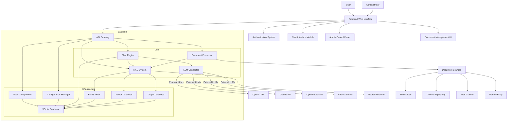
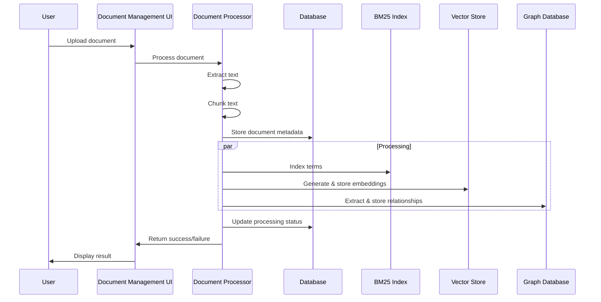
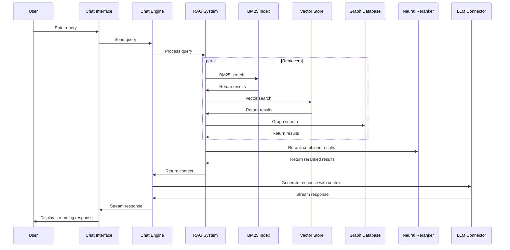
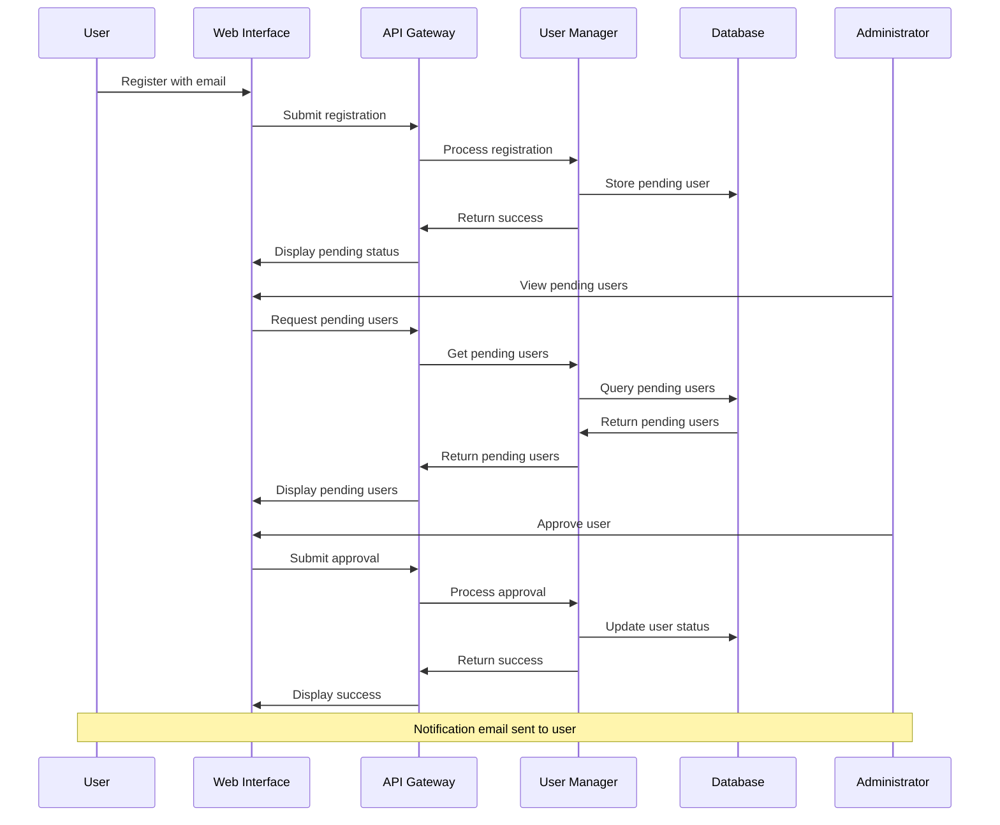

# Doogie RAG Chatbot System - Implementation Plan

## 1. System Architecture Overview

## 2. Component Breakdown and Specifications

### 2.1 Frontend Components

#### 2.1.1 Web Interface
- **Framework**: React.js with TypeScript
- **Styling**: Tailwind CSS with dark mode as default
- **State Management**: Redux or Context API
- **Features**:
  - Responsive design for various devices
  - Accessibility compliance
  - Dark/light mode toggle
  - Real-time response streaming

#### 2.1.2 Chat Interface
- **Features**:
  - Message streaming display
  - Chat history navigation
  - Response feedback system
  - Performance statistics display (tokens/s)
  - Session management
  - Reasoning tag handling (`<think></think>`)

#### 2.1.3 Admin Panel
- **Features**:
  - User management and approval
  - System settings configuration
  - API key management
  - System-wide prompt configuration
  - Analytics dashboard

#### 2.1.4 Document Management UI
- **Features**:
  - Document upload interface
  - GitHub repository integration
  - Web crawling configuration
  - Manual entry form
  - Document list view with metadata
  - RAG reset and reprocessing controls

### 2.2 Backend Components

#### 2.2.1 API Gateway
- **Framework**: FastAPI
- **Features**:
  - RESTful API endpoints
  - WebSocket support for streaming
  - Authentication middleware
  - Rate limiting
  - Request validation

#### 2.2.2 Chat Engine
- **Responsibilities**:
  - Manage chat sessions
  - Coordinate between RAG and LLM
  - Handle message streaming
  - Implement response generation logic
  - Track and store conversation history

#### 2.2.3 RAG System
- **Components**:
  - **BM25 Indexer**: Sparse retrieval using Pyserini or custom implementation
  - **Vector Store**: Dense retrieval using FAISS
  - **Graph RAG**: Relationship-based retrieval
  - **Neural Reranker**: Cross-encoder model for result relevance improvement
  - **Query Processing**: Query transformation and expansion
  - **Result Fusion**: Combining results from multiple retrieval methods

#### 2.2.4 LLM Connector
- **Features**:
  - Unified interface for different LLM providers
  - Model selection and configuration
  - Context window management
  - Token counting and optimization
  - Error handling and fallback strategies
  - API key management

#### 2.2.5 Document Processor
- **Features**:
  - Document parsing for multiple formats (PDF, DOCX, MD, RST, TXT)
  - Text extraction and normalization
  - Chunking strategies
  - Embedding generation
  - BM25 term indexing
  - Graph relationship extraction
  - Metadata extraction and storage

#### 2.2.6 User Management
- **Features**:
  - User registration and authentication
  - Role-based access control
  - Admin approval workflow
  - Profile management
  - Password reset functionality

#### 2.2.7 Configuration Manager
- **Features**:
  - System settings storage and retrieval
  - API key encryption and management
  - LLM configuration profiles
  - RAG system parameters
  - Default prompt templates

### 2.3 Infrastructure Components

#### 2.3.1 Database (SQLite3)
- **Schema Areas**:
  - User accounts and authentication
  - Chat history and feedback
  - Document metadata
  - System configuration
  - Processing logs and analytics

#### 2.3.2 Vector Store
- **Implementation**: FAISS
- **Features**:
  - Vector storage and retrieval
  - Similarity search
  - Indexing for performance

#### 2.3.3 BM25 Index
- **Implementation**: Custom or Pyserini
- **Features**:
  - Term indexing
  - Term frequency calculations
  - Sparse retrieval

#### 2.3.4 Graph Database
- **Implementation**: NetworkX or lightweight solution compatible with SQLite
- **Features**:
  - Document-entity relationships
  - Entity-entity relationships
  - Graph traversal for contextual retrieval

## 3. Implementation Phases

### Phase 1: Foundation and Core Structure (Weeks 1-2)
- Project initialization
- Docker configuration
- Basic project structure
- Database schema design and implementation
- Core API endpoints
- Authentication system

### Phase 2: Document Processing Pipeline (Weeks 3-4)
- Document parser implementations
- Text extraction
- Chunking strategies
- BM25 indexing
- Vector embedding
- Metadata storage
- Basic document management UI

### Phase 3: RAG System Implementation (Weeks 5-7)
- BM25 retrieval implementation
- FAISS vector search integration
- Initial query processing
- Result fusion mechanisms
- GraphRAG implementation
- Neural reranker integration
- Retrieval testing and optimization

### Phase 4: LLM Integration (Weeks 8-9)
- LLM connector architecture
- Ollama server integration
- API-based LLM integrations
- Model selection UI
- Context management
- Response generation
- Streaming implementation

### Phase 5: Chat Interface Development (Weeks 10-11)
- Chat UI implementation
- Real-time streaming display
- Chat history functionality
- Performance statistics
- Reasoning tag handling
- User feedback mechanisms

### Phase 6: Admin Features (Weeks 12-13)
- Admin panel development
- User management interface
- System settings configuration
- Document management controls
- Analytics dashboard
- System-wide prompt management

### Phase 7: Advanced Features and Optimization (Weeks 14-16)
- GitHub integration
- Web crawler implementation
- Manual entry form
- RAG reset and reprocessing
- Performance optimization
- Comprehensive testing
- Documentation

## 4. Technical Specifications

### 4.1 Development Environment
- **Language**: Python 3.12+
- **Database**: SQLite3
- **Containerization**: Docker and Docker Compose
- **Version Control**: Git
- **CI/CD**: GitHub Actions

### 4.2 Frontend Technologies
- **Framework**: React.js 18+
- **Styling**: Tailwind CSS
- **Build Tool**: Vite
- **API Client**: Axios/Fetch with React Query
- **WebSockets**: Socket.IO client

### 4.3 Backend Technologies
- **Framework**: FastAPI
- **ORM**: SQLAlchemy
- **Authentication**: JWT
- **Web Server**: Uvicorn
- **WebSockets**: FastAPI WebSockets
- **Background Tasks**: Celery or FastAPI background tasks

### 4.4 NLP & ML Components
- **Embedding Models**: Sentence Transformers
- **Reranking**: Cross-Encoder models
- **Vector Search**: FAISS
- **Sparse Search**: Pyserini or custom BM25
- **Graph Processing**: NetworkX

### 4.5 Docker Configuration
- **Services**:
  - Web Service
  - API Service
  - Worker Service (if needed)
  - Development tools
- **Volumes**:
  - Database persistence
  - Document storage
  - Vector indices

## 5. Key Considerations

### 5.1 Security Considerations
- Secure API key storage
- Input validation and sanitization
- Authentication and authorization
- Rate limiting to prevent abuse
- Data encryption for sensitive information

### 5.2 Performance Considerations
- Efficient chunking and indexing strategies
- Caching for frequently accessed documents
- Optimized vector search
- Background processing for document intake
- Response streaming for better user experience

### 5.3 Scalability Considerations
- Component-based architecture
- Clear interface boundaries
- Stateless API design
- Background workers for processing
- Efficient database indexing

### 5.4 Testing Strategy
- Unit tests for core components
- Integration tests for system interactions
- End-to-end tests for critical flows
- Performance benchmarking
- Security testing

## 6. Risk Analysis and Mitigation

| Risk | Probability | Impact | Mitigation |
|------|------------|--------|------------|
| LLM API availability/reliability | Medium | High | Implement fallback mechanisms, caching, and retry logic |
| Performance issues with large document collections | High | Medium | Implement efficient indexing, pagination, and background processing |
| Security vulnerabilities | Medium | High | Regular security audits, input validation, proper authentication |
| Complex GraphRAG implementation | High | Medium | Start with simple graph relationships, iteratively enhance |
| Integration challenges between components | Medium | Medium | Clear interfaces, comprehensive testing, modular design |
| User experience issues | Medium | High | Regular usability testing, feedback collection, iterative improvement |

## 7. Data Flow Diagrams

### 7.1 Document Processing Flow

### 7.2 Query Processing Flow

### 7.3 User Registration and Approval Flow

## 8. Conclusion

This implementation plan provides a comprehensive roadmap for developing the Doogie RAG chatbot system. The plan breaks down the system into manageable components, outlines implementation phases, and addresses key technical considerations.

The approach emphasizes a modular architecture with clear component boundaries, allowing for parallel development and easier maintenance. By following this plan, we aim to create a robust, performant, and feature-rich RAG chatbot system that meets all the specified requirements.

Key success factors will include:
- Effective integration of multiple retrieval methods
- Seamless LLM connectivity and model switching
- Intuitive user interface with responsive design
- Robust document processing pipeline
- Comprehensive admin controls and analytics

This plan will be refined and updated as development progresses and as we gain more insights into specific implementation challenges and opportunities.